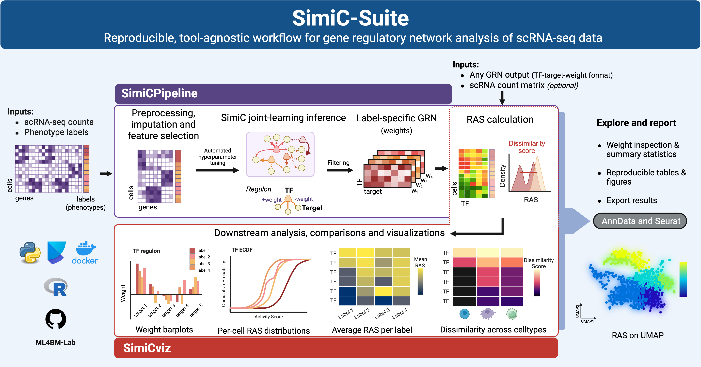

## Overview

SimiC-Suite is an open-source software framework for inferring and studying phenotype-specific gene regulatory networks (GRNs) from single-cell RNA-seq data. The suite combines robust network inference, regulon activity score (RAS) calculation, and comprehensive visualization tools into a unified workflow for exploring regulatory mechanisms across biological conditions.

Designed for reproducible and interpretable GRN analysis, SimiC-Suite supports researchers from data preprocessing and GRN inference through downstream assessment, visualization, and reporting.

::: {.graphical-abstract}
{fig-alt="Graphical abstract summarizing the SimiC-Suite workflow from single-cell RNA-seq inputs through SimiCPipeline, SimiCviz, and downstream reporting."}
:::

## Suite Components

::: {.component-grid}

::: {.component-card .pipeline-card}
### SimiCPipeline

Python package for phenotype-specific GRN inference, RAS calculation and downstream assessment and visualization of GRN outputs.

| Feature | Description |
|---|---|
| Ecosystem | Python |
| Role | Upstream inference and RAS calculation. Downstream assessment and visualization workflows described. |
| Tutorials | Jupyter notebooks from the package repository. |

[Open SimiCPipeline](simicpipeline.qmd){.btn .btn-primary}
:::

::: {.component-card .viz-card}
### SimiCviz

R package for tool-agnostic RAS calculation, assessment and visualization of GRN outputs.

| Feature | Description |
|---|---|
| Ecosystem | R / Bioconductor |
| Role | RAS calculation, downstream assessment, visualization, and reporting. |
| Tutorials | Local copy of the rendered package vignette. |

[Open SimiCviz](simicviz.qmd){.btn .btn-danger}

:::

:::

## Repositories

- SimiCPipeline: <https://github.com/ML4BM-Lab/SimiCPipeline>
- SimiCviz: <https://github.com/ML4BM-Lab/SimiCviz>
