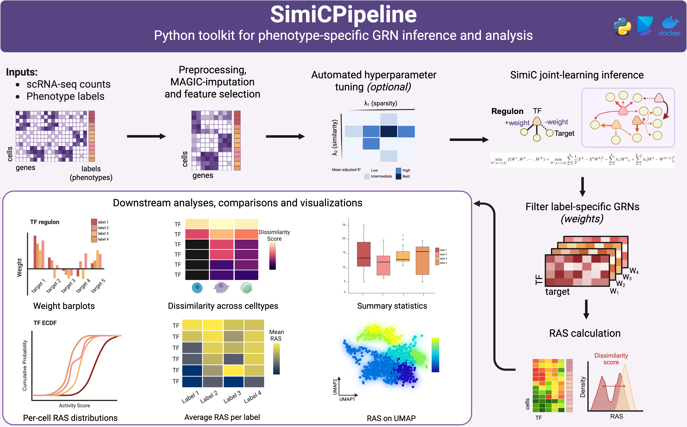

## Overview
SimiCPipeline is the Python component of SimiC Suite, enabling phenotype-specific GRN inference and RAS calculations from scRNA-seq data.

Built on the original SimiC framework, SimiCPipeline infers condition-aware regulatory networks by jointly modeling multiple biological phenotypes while preserving relationships between them. This enables the identification of both shared and phenotype-specific regulatory programs, facilitating the study of regulatory dynamics across cell states, experimental conditions, and disease phenotypes.

In addition to GRN inference, SimiCPipeline includes preprocessing workflows commonly required for regulatory network analysis, including gene filtering, highly variable feature selection, and MAGIC-based expression imputation. Starting from single-cell expression data and transcription factor annotations, the pipeline generates phenotype-specific GRNs, regulon definitions, and cell-level RASs for downstream interpretation.

Designed for reproducible and scalable analyses, SimiCPipeline serves as an upstream component of SimiC Suite, producing outputs that can be further assessed, visualized, and reported using SimiCviz.

::: {.graphical-abstract}
{fig-alt="Graphical abstract summarizing the SimiCPipeline workflow from single-cell RNA-seq counts and phenotype labels through preprocessing, hyperparameter tuning, phenotype-specific GRN inference, RAS calculation, and downstream analyses."}
:::

[View SimiCPipeline on GitHub](https://github.com/ML4BM-Lab/SimiCPipeline){.btn .btn-primary}

## Tutorials

The tutorials below link to the `ML4BM-Lab/SimiCPipeline` repository so they always reflect the package-maintained versions.

::: {.tutorial-grid}

::: {.tutorial-card .pipeline-card}
### Full Pipeline Tutorial

Complete SimiCPipeline walkthrough, including initialization, parameter configuration, GRN inference, RAS calculation, and downstream result inspection.

[Open notebook on GitHub](https://github.com/ML4BM-Lab/SimiCPipeline/blob/master/notebooks/Tutorial_SimiCPipeline_full.ipynb){.btn .btn-primary}
:::

::: {.tutorial-card .pipeline-card}
### Preprocessing Tutorial

Notebook covering data preparation steps for SimiCPipeline inputs, including expression data imputation, transcription factor and target gene selection, and phenotype labels.

[Open notebook on GitHub](https://github.com/ML4BM-Lab/SimiCPipeline/blob/master/notebooks/Tutorial_SimiCPipeline_preprocessing.ipynb){.btn .btn-primary}
:::

::: {.tutorial-card .pipeline-card}
### Visualization Tutorial

Notebook focused on inspecting and visualizing SimiCPipeline outputs after GRN inference and RAS calculation.

[Open notebook on GitHub](https://github.com/ML4BM-Lab/SimiCPipeline/blob/master/notebooks/Tutorial_SimiCPipeline_visualization.ipynb){.btn .btn-primary}
:::

:::

## Helper Scripts

These standalone scripts provide a simplified way to run the main steps of the SimiC workflow without using the full Jupyter notebooks. They are adapted from the reference notebooks included with SimiCPipeline, and can be used for command-line execution or integration into automated workflows.

- [run_preprocessing.py](https://github.com/ML4BM-Lab/SimiCPipeline/blob/master/notebooks/run_preprocessing.py): Performs data preprocessing and prepares input files for downstream SimiC analysis.

- [run_simicpipeline.py](https://github.com/ML4BM-Lab/SimiCPipeline/blob/master/notebooks/run_simicpipeline.py): Executes the core SimiC pipeline, including GRN inference and downstream analyses.
