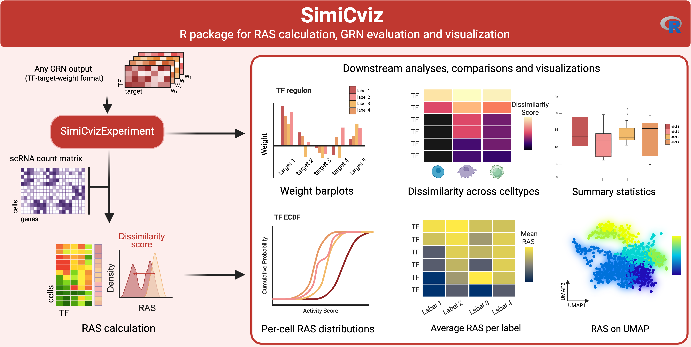

## Overview
SimiCviz is the R component of SimiC Suite, providing tool-agnostic methods for calculating RAS from inferred regulatory networks, assessing and comparing regulatory programs, and generating reproducible visualizations and reports. Compatible with outputs from SimiCPipeline and other network inference frameworks, it supports downstream interpretation of regulatory activity through network-level and cell-level analyses.

::: {.graphical-abstract}
{fig-alt="Graphical abstract summarizing the SimiCviz workflow from GRN outputs and optional single-cell RNA-seq counts to RAS calculation, downstream analyses, comparisons, and visualizations."}
:::

[View SimiCviz on GitHub](https://github.com/ML4BM-Lab/SimiCviz){.btn .btn-danger}

## Tutorial
::: {.tutorial-grid}

::: {.tutorial-card .viz-card}
### SimiCviz R Tutorial

Assessment and visualization workflow for GRN outputs, including loading GRN data, computing or importing RAS values, visualizing weights, and comparing regulatory programs across phenotypes.

[Open full tutorial](tutorials/simicviz/SimiCviz.html){.btn .btn-danger}
[View R Markdown source](tutorials/simicviz/SimiCviz.Rmd){.btn .btn-outline-danger}
[View R script](tutorials/simicviz/SimiCviz.R){.btn .btn-outline-danger}
:::

:::
